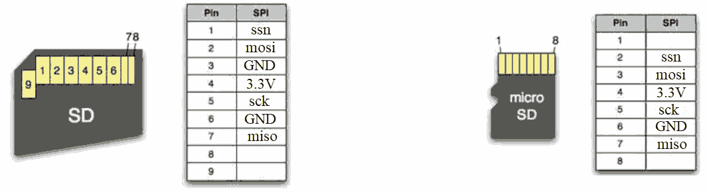

# SD-Card

## Notes for using an SD-card with SPI

Note: This research document is a bit messy, info is divided into separate documents for a more clear guidance to designing an sd card controller. Some documents take material from this ones and explain them further and others hold waveforms and lists of commands, steps and responses.

#### INIT commands

Note. CMD55 often left out in init guides but is needed since it tells the card that the next command is type ACMD, without CMD55, ACMD41 will not be responded to correctly.

| COMMAND | Purpose | Dataline (MOSI) | Response |
| --- | --- | --- | --- |
| CMD0 | Reset card and request SPI mode | 0x 40 00 00 00 95 | R1 = 0x01 idle state entered |
| CMD8 | Check voltage range and card generation | 48 00 00 01 AA 87 | R7 echo ending in 0x01AA for SDv2+ |
| CMD55 | Prefix next command as application-specific | 77 00 00 00 00 01 |  R1 = 0x01 while still idle |
| ACMD41 | init command: send same command & check response until ready | 69 40 00 00 00 01 | 0x01 busy, when 0x00 it is ready | 
| CMD58 | Read OCR and card capacity status | 7A 00 00 00 00 01 | R3; use CCS to distinguish SDSC from SDHC/SDXC |
| CMD16 | Set block length for SDSC access | 50 00 00 02 00 01 | Use when you need 512-byte SDSC block transfers | 

When CS Chip Select is set from high to low, the card expects a command. CS must stay low for the duration of the operation.  
"To manage clock domain crossing or prevent data getting skipped, 8 pulses are inserted between command and response." 
- https://repository.rit.edu/cgi/viewcontent.cgi?article=10950&context=theses 

#### additional notes

Enable CRC with CMD59 (after init) otherwise commands dummy crc bits 0x01 and will be ignored by tx and rx of the card. Do we need/want CRC? 
    CCITT polynomial x16+x12+x5+1.  for crc calc.

SPI has 4 modes, affects whether read on rising edge or falling and affects how data is shifted. SPI mode 0 probably easiest to use. 

Data transfer available 1bit/clk cycle so for init 400kHz 40 kB/s and after init for data if 20MHz 2,5 MB/s 

### Structure of an SD-card

  
- https://www.dejazzer.com/ee379/lecture_notes/lec12_sd_card.pdf  

### Versions

`NOTE: Not all versions of sd cards support the same commands. CMD18 (READ-MULTIPE_BLOCK) fails for some cards. Newer cards have CMD55 & ACMD41 for init while older cards use just CMD0. Commands and functions defined after version 2.0 of specification are not supported in SPI-mode, the card might respond to the commands regardless but operations inside the card wont work, host should not use them`

SD (SDSC): 2GB, mostly legacy  
SDHC: 2-32GB  
SDXC (SD v2): 64GB - 2TB, used widely for 4k video  
SDUC:  2GB - 128TB  

- SDHC or SDXC probably what will be used.
- bootloader size? hunderds of KB??
- RTOS?? 10-100 MB or more?
- do we need room for just bootloader or more?

SDHC and SDXC seem to slightly differ in some commands, so needs either support for both or just one.

### Speed classes

UHS-I  
UHS-II  
UHS-III  
SD-EXpress  

- SPI doesn't support any of these.

### clk speed

500kHz is a typical SPI speed for SDcard ??? many sources claim 100 - 400kHz window for init.  
During operation: 20-25 MHz    
  
DO == MISO
https://elm-chan.org/docs/mmc/mmc_e.html#spimode 

SPI limits speed. 25 MHz is guaranteed by specification.

maximum allowable SCLK frequency can be calculated as:  
FSCLK(max) = 0.5 / (td + tsu) where td is propagation delay and tsu setup time.
- https://elm-chan.org/docs/mmc/mmc_e.html#spimode 

#### SDSPI zipCPU

zipCPU sdspi uses sclk 400 khz for init, 20 MHz for operations.

### Voltage level

ACMD41 sets the sd card voltage level. 3.3V used typically, confirm this from experts. Do we have I/O banks??  Do we want/support other voltage values?
"The SPI bus solely supports a 3.3V power supply" - https://www.it-sd.com/articles/secure-digital-card-commands/  
The CMD8 48 00 00 01 AA 87  sends 0x01 AA additional command fields, where 01 asks whether the 2.7-3.6 voltage range is supported. If the card supports this voltage range it echoes back 01 AA in response. AA is for error checking and it can be defined as anything from the host, e.g. A1, as long as the response matches the pattern, init can continue and the host can set the voltage to what it needs between the allowed range.  
Powerup keep powerline less than 0.5V for more than 1ms before power ramp up, Operating voltage between 2.7V - 3.6V  

### SPI-mode

1-bit data path,

MISO Master In Slave Out  
MOSI Master Out Slave In  
CS( SSEL) Chip select  
SCLK   

CS transition from high to low initiates operation, must stay low during operation. So for init, the CS is low through command and responses the whole time.  
When MISO is driven high the card is ready to receive a data packet. Data is sent and responded to in fixed size packets. When MISO is High and MOSI transitions from high to low and back high in the next cycle, this is marked as the start of the packet.
After a command frame (which consists of start_bit (0) and transmission_bit (1), and 6 additional fields) is sent, The MOSI is driven high to wait for response. 

48 bit wide packet
| start bit | transmission | CMD (comand argument) | - | - | - | - | CRC (Error checking) | delay for ending the operation. |
| --- |  --- | --- | --- | --- | --- | --- | --- | --- |
| 1 bit | 1 bit | 6 bits | 8bits | 8bits | 8bits | 8bits | 7 bits | 1bit |

Data and commands consists of 8bit wide packets, upper packet def separates interesting bits from their packets for functional clarity. The card counts sclk cycles in groups of 8 and uses this to read from the 1-bit wide data line MOSI.

- https://academy.cba.mit.edu/classes/networking_communications/SD/SD.pdf page 227 SPI MODE

  
sd-cards point of view: DO = MISO, DI = MOSI
- https://elm-chan.org/docs/mmc/mmc_e.html#spimode 

### SD-INIT

Init starts with atleast 74 clk pulses with (SSEL aka. CS) high. 

"Set the MOSI and CS lines to logic value 1 and toggle SD CLK for at least 74 cycles. After the 74 cycles (or 
more) have occurred, your program should set the CS line to 0 and send the command CMD0." - https://www.dejazzer.com/ee379/lecture_notes/lec12_sd_card.pdf

Typically sclk needs to be 100 - 400 kHz for CMD0, CMD8, CMD55, ACMD41 and CMD58.  
Depending on SD-card used, the speed can after init be up to 25 MHz or even 50 MHz. Confirm this from other sources, check actual sd card specs based on model used.

For the following commands look at sdv2_init.md for waveforms.

Start. CS high for atleast 74 cycles for the card to power up. 
1. CMD0 (GO_IDLE_STATE) (response format R1).
    - Triggers the SD-card to use SPI-interface  
Commands start from MSB to LSB with a start_bit (0) and transmission_bit (1), after them the 6 command bits follow: so start is seen as 0100 0000 or h'40

    So CMD0 is seen when data is set h'40. After CMD0, 4 bytes follow that configure parameter data and fifth for error checking (CRC). Only CMD0 (GO_IDLE_STATE) and CMD8 (SEND_IF_COND) must have valid CRC. Optional for other commands. CRC can be skipped (how??). The response from the SD card 0x01 means that idle state has been entered.

2. CMD8 (SEND_IF_COND) (response format R7) (determines whether SDXC is supported)
    Error here? bits 
    - send MOSI: 0x48 00 00 01 AA 87
    - Modern cards expect R7 response, where tail echoes 0x00 00 01 AA
    - ver1.x cards give illegal command. Use CMD58 to read OCR and determine if the plugged in card is an sd memory card at all.

3. CMD55 (response format R1)
    - Tells the card that the next command is application specific aka. ACMD. This is used for a newer way to init in an SD-specific way. Replaced CMD1 (older) as init command. MMC and Early SD-cards used CMD1.

4. ACMD41 (response format R1)  `Important for different card versions, affects data block reading`
    - After the ACMD41 loop succeeds, send CMD58 to read the OCR register and inspect the CCS bit.  
    - if CCS = 1: (card type: SDHC or SDXC) Memory commands use block addressing and 512-byte blocks.  
    - if CCS = 0: SDSC. Memory commands use byte addressing; set 512-byte block length with CMD16 if needed.  

    - if response is not idle, loop back to CMD55. 
    - SDUC cards can stay busy and not reply ready to host during ACMD41, indicating that SPI is not supported. 

5. CMD58 READ_OCR (response format R3)
    - Reads OCR HCS-bit (High capacity select) register to determine SD card cappacity, high capacity SDHC or standard v2 sd card is determined by this.
    - Provides sd card host with the cards voltage range support and tells if the card does not support the voltage range given at ACMD41.

    TODO section 5.1 of https://academy.cba.mit.edu/classes/networking_communications/SD/SD.pdf for more info on ocr and/or check official spec for info on all registers in the sd card.

6. CMD16 SET_BLOCKLEN (response format R1 + data)  
`This command is sent for different types of sd cards to conf block length, 512 bytes allow to be used with atleast SDHC and older cards, command is not needed to be sent for SDHC since 512 is default for it but other cards need this command.`
 -  "In case of SDHC and SDXC Cards, block length is fixed to 512 Bytes regardless of the block length set by CMD16." -https://www.taterli.com/wp-content/uploads/2017/05/Physical-Layer-Simplified-SpecificationV6.0.pdf 
 - max 512-bytes.

CS (or SSEL) is set high after this and SCLK can be increased.

    - check response format from simplified datasheet physical layer https://www.sdcard.org/downloads/pls/pdf/?p=Part1_Physical_Layer_Simplified_Specification_Ver9.10.jpg&f=Part1PhysicalLayerSimplifiedSpecificationVer9.10Fin_20231201.pdf&e=EN_SS9_1 

### Responser Formats

### R1

Holds several error messages. Should return 0x01 when idle.  
Check https://www.it-sd.com/articles/secure-digital-card-commands/ for more information.

### R3

5 bytes long, first byte the same as R1. the rest have the contents of the OCR register.

### R7 

### Read

How should the sd card sectors be divided?

Does CMD58 READ_OCR need to be sent again? in some software cases used to make a function independent of others???  
CMD10 SEND_CID Card identification Is this needed??  
CMD17 READ_SINGLE_BLOCK  512-byte sector (or smaller if defined)  
CMD18 READ_MULTIPLE_BLOCK    

CMD12 STOP_TRANSMISSION
(check whether CMD23 SET_BLOCK_COUNT is supported/needed on newer cards)
 
### CRC

CRC: Cyclic Redundancy Check, Error-detection required for CMD0 and CMD8, other use dummy 0x01 and CRC use is optional. CRC use set with CMD59 (`probably good idea for all commands in booting`)

CRC7 used for sd cards so for CMD0 with no parameter data 0x40 00 00 00 00, the CRC7 is 0x4A which is appended after sifting and adding LSB 1 (0x4A << 1 | 1) = 0x95.

For `CMD0` MOSI: 0x40 00 00 00 00 95  (CRC: 0x95)
For `CMD8` MOSI: 0x48 00 00 01 AA 87  (CRC: 0x87)

### [COMMON FAILURES](https://nodeloop.org/guides/sd-card-spi-init-guide/)

No 0x01 after CMD0:
- CS was not high during dummy clocks
- Initialization clock is too fast
- The command frame or CRC byte is wrong
- The card is not actually powered or level shifted correctly.  

ACMD41 never exits idle
- CMD8 was skipped on a modern card.
- HCS was left clear while talking to SDHC or SDXC media.
- CMD55 and ACMD41 sequencing is wrong.
- The SPI clock is still out of range for initialization.  

CMD8 fails unexpectedly
- The card may be older SDSC or MMC.
- The host may not be clocking out enough bytes to read the full R7 response.
- The line is sampled too early while the card still returns 0xFF.

Reads and writes hit the wrong block
- SDSC: memory commands use byte addresses and usually need CMD16.
- SDHC or SDXC: memory commands use block addresses with fixed 512-byte blocks.
- If the offset looks wrong by 512x, check your CCS handling first.

### SPI

#### INIT

SPI controllers do not follow a strict standard. TI spi init given for comparison.

Texas instrument init for spi conroller for comparison, compare with pulpino datasheet for register init.

1. Reset the SPI by clearing the RESET bit in the SPI global control register 0 
(SPIGCR0) to 0. 
2. Take the SPI out of reset by setting SPIGCR0.RESET to 1. 
3. Configure the SPI for master mode by configuring the CLKMOD and MASTER 
bits in the SPI global control register 1 (SPIGCR1). 
4. Configure the SPI for 3-pin or 4-pin with chip select mode by configuring the SPI 
pin control register 0 (SPIPC0). 
5. Choose the SPI data format register n (SPIFMTn) to be used by configuring the 
DFSEL bit in the SPI transmit data register (SPIDAT1). 
6. Configure the SPI data rate, character length, shift direction, phase, polarity and 
other format options using SPIFMTn selected in step 5. 
7. In master mode, configure the master delay options using the SPI delay register 
(SPIDELAY). 
8. Select the error interrupt notifications by configuring the SPI interrupt register 
(SPIINT0) and the SPI interrupt level register (SPILVL). 
9. Enable the SPI communication by setting the SPIGCR1.ENABLE to 1. 
10. Setup and enable the DMA for SPI data handling and then enable the DMA 
servicing for the SPI data requests by setting the SPIINT0.DMAREQEN to 1. 
11. Handle SPI data transfer requests using DMA and service any SPI error 
conditions using the interrupt service routine.

- https://www.ti.com/lit/ug/sprugp2a/sprugp2a.pdf?ts=1783389377487&ref_url=https%253A%252F%252Fwww.google.com%252Fgoto%253Furl%253DCAESVgHuR6pNLMF99mQF4MhnjhshYhHiYn9BqpzWc7CTrOP7DfpFGNR0f5pssnLfs_a8CzGlgwDVBcmmDz8P1cg5Yrdq1hEPfmqzA1LVf320ZObwAhqG0ub1 

for the pulp SPI:
1. STATUS register Addr: 0x1A10_2000 has SRST at bit 4

### Bonus

Separate boot functionality, partitioning and security of independent boot sector available but not with SPI.

Card data storage is divided into multiple sectors, each sector contains 512 bytes,

### Sources

[1] https://nodeloop.org/guides/sd-card-spi-init-guide/  
[2] http://bikealive.nl/sd-v2-initialization.html  (Note: HTTP not HTTPS)
[3] https://www.dejazzer.com/ee379/lecture_notes/lec12_sd_card.pdf   
[4] https://elm-chan.org/docs/mmc/mmc_e.html#spimode 