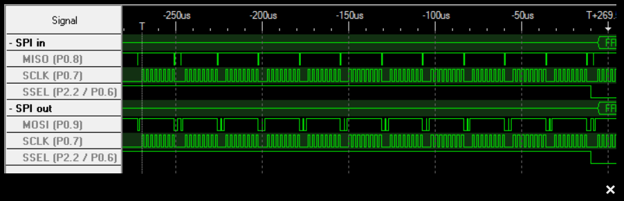
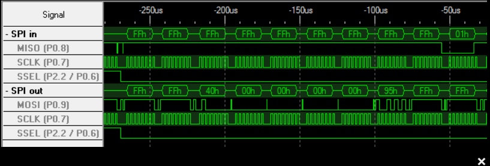
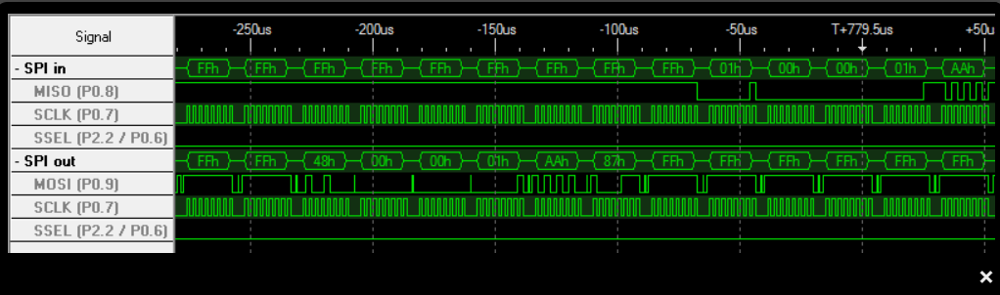
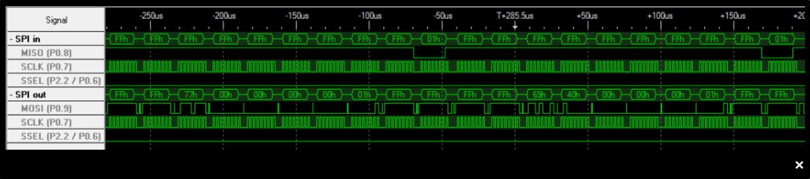
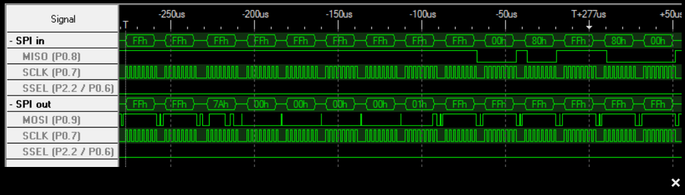
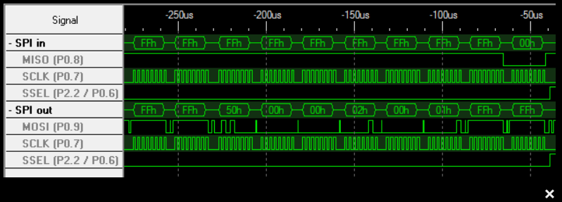

**/*.png

## SD V2 init

Example for microcontroller to sd card init with sd card 2.0 version.

### INIT

### CMD 0: GO_IDLE_STATE

### CMD8: SEND_IF_COND

### ACMD41: SEND_OP_COND

wait until sd leaves idle state

### CMD 58: READ_OCR

### CMD 16: SET_BLOCKLEN

